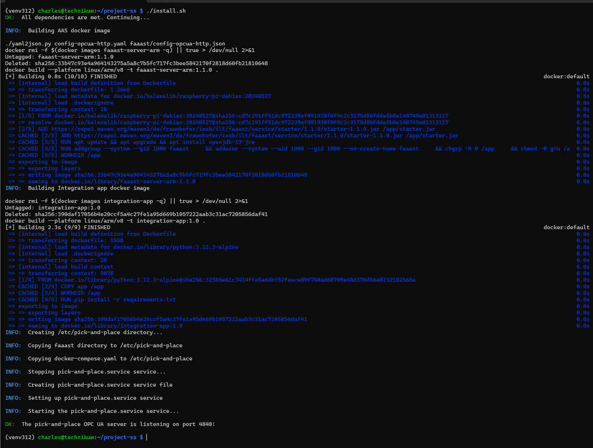
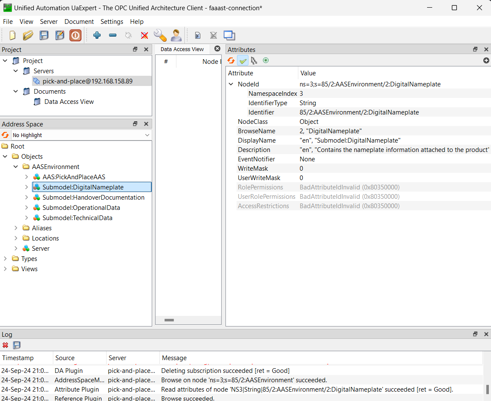

# Industrie 4.0-compliant Digitalization of a Pick and Place Module with Real-time Asset Integration

This repository contains the sources for a prototype of an AAS-compliant digital twin for a pick-and-place module at the Digital Factory of the University of Applied Sciences in Emden. It uses the RAMI4.0 model as the theoretical framework and the FA³ST service tool as the central implementation technology. The project focuses on the real-time synchronization of the asset's data to and from the digital twin.

<p align="center">

<p align="center">Pick and Place module and components</p>
</p>

## Implementation

The digital twin is embedded in the module, running in a Raspberry Pi. 
The whole digitalization is composed of two main parts:
- The information and communication is implemented using the [FA³ST service tool](https://faaast-service.readthedocs.io/en/latest/index.html). 
- The asset integration is implemented with a python application. This application interfaces with the module's Delta robot and gripper and exposes their data as an HTTP API.

These two main components run as docker containers. This reduces any software and hardware compatibility problems and facilitates the installation. The source code for them can be found as:
- [FA³ST service](./aas)
- [Integration app](./integration) .

The diagram below shows the components of the implementation.

<p align="center">

<p align="center">Digital Twin Implementation</p>
</p>


## Installation

The installation sets up all dependencies required and consists on building the docker images and adding a systemd service so the OPC UA service starts upon system startup.

First, copy this project into the Raspberry Pi. Make sure to use a user that has sudo permissions.

```bash
rsync -a --delete ${PROJECT_ROOT}/ <user>@<hostname>
```

Then, login to the Raspberry Pi and run the [install script](./install.sh).

```bash
./install.sh
```

You should see a successful output upon completion.

<p align="center">

<p align="center">Successful installation output</p>
</p>


## Connecting to the OPC UA service

With an OPC UA client (UAExpert recommended) connect to the OPCUA service running in the RaspberryPi with this discovery URL:

```
opc.tcp://192.168.158.89:4840
```

You should see the PickAndPlace AAS and its submodels in the Address Space panel.

<p align="center">

<p align="center">UAExpert successful connection</p>
</p>


